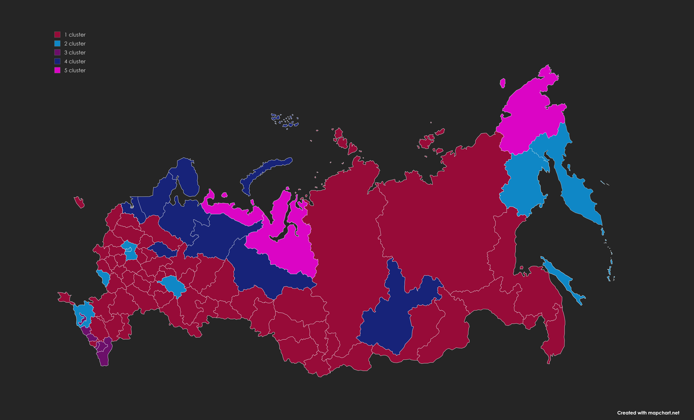

# Кластерный анализ социально-экономических показателей регионов России

---

## О проекте

В рамках курса "Многомерные статистические методы и прогнозирование" проведена многомерная классификация субъектов РФ по социально-экономическим и демографическим показателям.

**Цель:** выявить однородные группы регионов (кластеры) для последующей экономической интерпретации и разработки рекомендаций.

## Структура репозитория
<pre>
README.md                        # Описание проекта
russian_regions_clustering/
├── data/
│ └── data.xlsx                  # Исходные данные (85 регионов × 9 признаков)
├── notebooks/
│ └── clustering_analysis.ipynb  # Jupyter Notebook с полным анализом
├── images                       #Графики
└── reports/
└── clustering_report.pdf        # Полный аналитический отчёт (PDF)
</pre>

**Объект исследования:** 85 субъектов Российской Федерации.

**Предмет исследования:** 9 показателей, характеризующих демографическое и экономическое состояние регионов:

| **Показатель** | **Описание** |
|:---|:---|
| X1 | Численность населения с доходами ниже прожиточного минимума (%) |
| X2 | Среднедушевые доходы населения (в месяц), руб. |
| X3 | Потребительские расходы в среднем на душу населения (в месяц), руб. |
| X4 | Смертность населения трудоспособного возраста, на 100 000 человек |
| X5 | Заболеваемость на 1000 человек населения |
| X6 | Численность населения на одну больничную койку |
| X7 | Выбросы загрязняющих веществ в атмосферный воздух на 10 000 человек (тыс. тонн) |
| X8 | Использование свежей воды на 10 000 человек (млн м³) |
| X9 | Сброс загрязненных сточных вод в поверхностные водные объекты на 10 000 человек (млн м³) |

---

## Используемые методы

- **Иерархические агломеративные методы**:
  - Полной связи (Complete linkage)
  - Средней связи (Weighted / Average linkage)
  - Уорда (Ward)
- **Метод K-средних** (k-means)
- **Оценка качества кластеризации** — функционал качества разбиения
- **Визуализация** — дендрограммы, графики средних, карта России

**Инструменты**: Python (pandas, numpy, scikit-learn, scipy, matplotlib).

---

## Ход выполнения работы

### 1. Загрузка и стандартизация данных
```python
data_raw = pd.read_excel('data/питон_3.xlsx', index_col='Регион')
data = scale(data_raw)  # центрирование и нормирование
```
### 2. Построение дендрограмм для иерархических методов
```python
CLUSTER_METHODS = ["complete", "weighted", "ward"]
def dendra(data, method, threshold):
    Z = hierarchy.linkage(data, method=method, optimal_ordering=True)
    plt.figure(figsize=(20,12))
    hierarchy.dendrogram(Z, labels=data.index, leaf_font_size=10, color_threshold=threshold)
    plt.axhline(y=threshold, color='r', linestyle='--')
    plt.title('{} method'.format(method))
dendra(data, 'complete', 9.6)
dendra(data, "weighted", 7.5)
dendra(data, "ward", 11.5)
```
### 3. Кластеризация (далее представлен код лучшего метода на основе функционала качества разбиения)
```python
from sklearn.cluster import AgglomerativeClustering
complete = AgglomerativeClustering(n_clusters=5, linkage='complete') #Метод полных связей
complete.fit(data)
print("complete\n", complete.labels_+1)
```
### 4. Расчет средних значений по кластерам
```python
def mean_df(method, n_clust):
    mean_data = np.array([]).reshape(0, f_len+1)
    for n in range(n_clust):
        tmp = []
        for j in range(f_len):
            tmp.append(data[data[method] == n].iloc[:, j].mean())
        tmp.append(data[data[method] == n].shape[0])
        mean_data = np.vstack((mean_data, np.array(tmp).reshape(1, f_len+1)))
    return mean_data
for method in CLUSTER_METHODS:
    means[method] = pd.DataFrame(
        mean_df(method, N_CLUSTERS[method]),
        columns=features + ['count'],
        index=["{}_{}".format(method, i) for i in range(N_CLUSTERS[method])]
    )
```
### 5. Построение графиков средних
```python
for method in CLUSTER_METHODS:
    cur_mean = means[method]
    plt.figure(figsize=(16,5))
    for n in range(cur_mean.shape[0]):
        plt.plot(features, cur_mean.iloc[n, :-1], marker='o', label='cluster {}'.format(n))
        plt.legend(loc='upper left')
    plt.title('{} method'.format(cur_mean.index[1][:-2]))
```
### 6. Оценка качества кластеризации
```python
Q_dict = {}
for method in N_CLUSTERS.keys():
    t = 0
    # Получаем средние для этого метода (DataFrame с индексом = номера кластеров или 0..n-1)
    method_means = means[method]  # предполагается, что индексы: 0, 1, ..., N-1
    for n in range(N_CLUSTERS[method]):
        cluster_data = cluster_dict[f"{method}_{n}"]  # DataFrame с объектами в кластере n
        mean_row = method_means.iloc[n]  # серия средних значений по признакам
        # Вычисляем Q для этого кластера
        q = 0
        for i in range(len(cluster_data)):
            squared_dist = 0
            for feature in features:
                squared_dist += (cluster_data.iloc[i][feature] - mean_row[feature]) ** 2
            q += squared_dist
        t += q
    Q_dict[f'Q_{method}'] = float(round(t, 3))
Q_dict
```
---

<!-- Визуализации -->
## Визуализации

### Дендрограммы и графики средних

<table width="100%" style="border-collapse: collapse; text-align: center;">
  <thead>
    <tr>
      <th style="width: 18%; background-color: #f2f2f2; padding: 8px;">Метод кластеризации</th>
      <th style="width: 41%; background-color: #f2f2f2; padding: 8px;">Дендрограмма</th>
      <th style="width: 41%; background-color: #f2f2f2; padding: 8px;">График средних по кластерам</th>
    </tr>
  </thead>
  <tbody>
    <tr>
      <td style="padding: 8px; vertical-align: middle;"><strong>Полной связи (Complete linkage)</strong></td>
      <td style="padding: 8px; vertical-align: middle;">
        <a href="regions_clustering/images/complete_method.png" target="_blank">Дендрограмма полной связи</a>
      </td>
      <td style="padding: 8px; vertical-align: middle;">
        <a href="regions_clustering/images/complete_method_graf.png" target="_blank">Средние полной связи</a>
      </td>
    </tr>
    <tr>
      <td style="padding: 8px; vertical-align: middle;"><strong>Средней связи (Weighted / Average linkage)</strong></td>
      <td style="padding: 8px; vertical-align: middle;">
        <a href="regions_clustering/images/weighted_method.png" target="_blank">Дендрограмма средней связи</a>
      </td>
      <td style="padding: 8px; vertical-align: middle;">
        <a href="regions_clustering/images/weighted_method_graf.png" target="_blank">Средние по методу средней связи</a>
      </td>
    </tr>
    <tr>
      <td style="padding: 8px; vertical-align: middle;"><strong>Уорда (Ward)</strong></td>
      <td style="padding: 8px; vertical-align: middle;">
        <a href="regions_clustering/images/ward_method.png" target="_blank">Дендрограмма по Уорду</a>
      </td>
      <td style="padding: 8px; vertical-align: middle;">
        <a href="regions_clustering/images/ward_method_graf.png" target="_blank">Средние по методу Уорда</a>
      </td>
    </tr>
    <tr>
      <td style="padding: 8px; vertical-align: middle;"><strong>К-средних (k-means)</strong></td>
      <td style="padding: 8px; vertical-align: middle; color: #999;">не применимо</td>
      <td style="padding: 8px; vertical-align: middle;">
        <a href="regions_clustering/images/k-means_method_graf.png" target="_blank">Средние по методу К-средних</a>
      </td>
    </tr>
  </tbody>
</table>

---

### Карта регионов по кластерам (метод полных связей)

<p align="center">
  <a href="regions_clustering/images/map.png" target="_blank">
    
  </a>
  <br>
  <em>Нажмите на карту для просмотра в полном размере</em>
</p>

---

## Заключение

После сравнения четырёх методов кластеризации по **функционалу качества разбиения** (сумма внутрикластерных расстояний) наилучший результат показал **метод полных связей**.

### Функционал качества разбиения

<table width="100%" style="border-collapse: collapse; text-align: center; margin: 0 auto;">
  <thead>
    <tr>
      <th style="background-color: #f2f2f2; padding: 8px;">Кластер       </th>
      <th style="background-color: #f2f2f2; padding: 8px;">Полных связей </th>
      <th style="background-color: #f2f2f2; padding: 8px;">Средней связи </th>
      <th style="background-color: #f2f2f2; padding: 8px;">Уорд          </th>
      <th style="background-color: #f2f2f2; padding: 8px;">K-средних     </th>
    </tr>
  </thead>
  <tbody>
    <tr>
      <td style="padding: 6px;"><strong>1</strong></td>
      <td style="padding: 6px;">183.13</td>
      <td style="padding: 6px;">0.00</td>
      <td style="padding: 6px;">99.74</td>
      <td style="padding: 6px;">157.98</td>
    </tr>
    <tr>
      <td style="padding: 6px;"><strong>2</strong></td>
      <td style="padding: 6px;">60.26</td>
      <td style="padding: 6px;">4.66</td>
      <td style="padding: 6px;">89.09</td>
      <td style="padding: 6px;">35.79</td>
    </tr>
    <tr>
      <td style="padding: 6px;"><strong>3</strong></td>
      <td style="padding: 6px;">39.34</td>
      <td style="padding: 6px;">75.26</td>
      <td style="padding: 6px;">143.01</td>
      <td style="padding: 6px;">193.67</td>
    </tr>
    <tr>
      <td style="padding: 6px;"><strong>4</strong></td>
      <td style="padding: 6px;">81.38</td>
      <td style="padding: 6px;">434.07</td>
      <td style="padding: 6px;">162.30</td>
      <td style="padding: 6px;">45.57</td>
    </tr>
    <tr>
      <td style="padding: 6px;"><strong>5</strong></td>
      <td style="padding: 6px;">35.79</td>
      <td style="padding: 6px; color: #999;">—</td>
      <td style="padding: 6px; color: #999;">—</td>
      <td style="padding: 6px; color: #999;">—</td>
    </tr>
    <tr style="font-weight: bold; background-color: #f9f9f9;">
      <td style="padding: 8px;"><strong>Итог</strong></td>
      <td style="padding: 8px;">399.90</td>
      <td style="padding: 8px;">513.99</td>
      <td style="padding: 8px;">494.14</td>
      <td style="padding: 8px;">433.01</td>
    </tr>
  </tbody>
</table>
